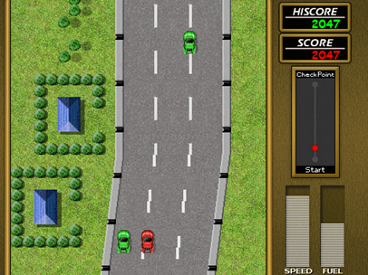

<H1 align = "center">Road Fighter Remake </H1>

  

This repository aims to do some modifications / enhancements to the original Road Fighter remake, developed by Braingames and sent to the RETROREMAKES REMAKE COMPETITION in the year of 2003. 

You can find the original RoadFighter remake in the official website: 

http://roadfighter.jorito.net

## Goals of the project

This project was developed before I joined the Braingames group. Despite that, I have always been a fan of this game, and having previously created a patch to the original MSX *Road Fighter* with a new wave soundtrack (available <a href="https://github.com/MauricioBraga/ROAD-FIGHTER-WAVE"> here </a>), I decided to also bring a few elements to this remake:

- SDL3 support, replacing the old deprecated SDL 1.2 lib used in the original game, making it also possible to generate 64 bit binaries of the game.
- New music to each level (allowing the use of different sound sets).
- Minor enhancements (cheat mode, new SFX, maybe new graphic and animations)

## Original RoadFighter remake credits:

- Programming: Santi Ontañón
- Graphics: Miikka Poikela
- Music/SFX: Jorrith Schaap
- Beta Testing: Jason Eames, Miikka Poikela, Jorrith Schaap, Santi Ontañón
* Copyright (c) 2003-2009 **(Brain Games)** 

## Special Thanks To:

 * The Retro Remakes crew, for organizing this wonderful competition!
 * Konami, for releasing the original game!
 * Lars the 18TH, for the gamemap picture
 * Manuel Bilderbeek, for the Linux port

## Legal notice

This is the unofficial remake of Konami **ROAD FIGHTER** which was originally
released in 1985 for the MSX home computer systems.

This repository is provided "as is". All rights to the original game remain with Konami and the original developers. 

The Braingames team (me included) would like to make it clear that we are not related to Konami in any way except for liking their excellent games. 

This is a not-for-profit remake. So, we don't get any money from remaking
this or any other Konami titles.

Also, the repository will be removed if Konami, Warner or their legal representatives ask me to do so.

